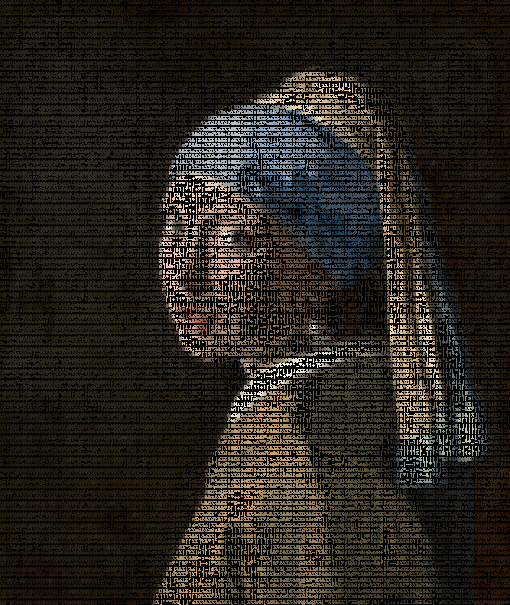
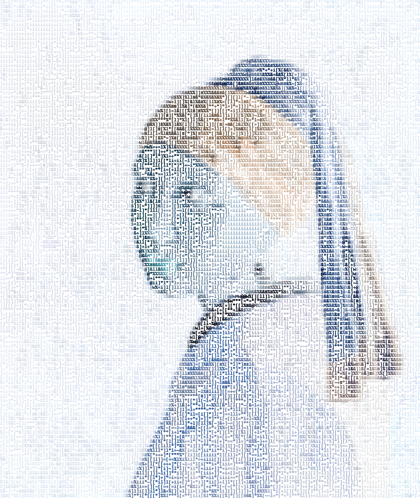

# Gallery (Contour Shade ASCII Filter)

1️⃣ `cd` to `src/contour_shade`.

---

<p align="center">
    
</p>

```commandline
python contour_shade.py ^
--image_path ../../resource/imgs/girl_with_pearl_earring.jpg ^
--resize_factor 4 ^
--contrast_factor 16 ^
--thresholds_gamma 5 ^
--color_option original
```

---

<p align="center">
    
</p>

```commandline
python contour_shade.py ^
--image_path ../../resource/imgs/girl_with_pearl_earring.jpg ^
--resize_factor 4 ^
--contrast_factor 16 ^
--thresholds_gamma 5 ^
--color_option original ^
--invert_color
```

---

```text
@@@@@@&@@@W@@%@&WW*@@%@&@W@@@&@&@@W@@%l%@@@$@@$%&@M@%88%@@M@W@@@%@@@@@@@@W@@@W@W@@W%&%&&&%$WM&&@@WW&W$@@@@@@W%@]M@@@@@@@@WMM@@@@@@@@W@@@@@$%@@@M@$M@@W&M@@@@@
@@@@W8@@@&M@WW&@W@%@WWM$MM@$@@&@W&@@@@[B@@%%@@W&8&%&&&&@@@&@@@@@@M@@@M@@@@@M@%W@@@&&@@@WM%&@M&&%@8B&W@M@MW@@@M@@@@@@@@@@@&@@@@@@@@M@@@@@@@&W$B@@&MM@@@@@@@@@@
@@@@@&&@@B@@@@&@WW@WM@@@@@@@@@M@@W$@@$@@@@%@@$%+%&&B@&@@@@@@@W@M@@@@@&@@@@@$$@M@@@@@&@@@@B%@@@@W@@@@@@@@M@@@@@@@@@@@@@@@@@&%W$@@@@@@@%&M@WM@W8@@@W@@%%@@@@@@@
@@W@@&%@@@@@@M@%W@@&B&@@@MM@@@@@%&@@@@$$M@@@@@&@@&@&$B@@@$@@@@@@W&@@@M@@@@$M@&&@@@@@&%@M@@@M@@@M@@@@M@@@@@@@@@@&@@@$@@@@@@M%%M@WM@W@$&@@@@@@@@WW@&@@&%W@@$WMW
@@@@M%B@$@MM@@@&W@$@M@@W$@@@@@WW@@@$$@@@@@$W@M@@$@$M@@$M@@$@@@@8@M@M@%@@M@$W@M@@@@@@@@@$$@@$@@$@@@@@@@$@@@@@M@@M@@@W@@@@$@@W@@@@@@@8@@M@@@@@@@@@@@@@@&&@@@@W@
$@@&&@%@M@@W@B@&%&&@$WW$@&@@@@@@@@@&&W@@@@&%&&@&%@$@W@%&@@@@@@@@@M@M@&&@@@@@$@@M@@@@@@@%@@@@@@@@@@@@@@M@$@@@@@@@@@B@MW@M@@@@@@@@@W$@@@@@@@@@@@@@@@@@$&@@B@M@@
M@@%@$%$@@@@@@&&&W&@%&&&@&@@@@@@$@@%&@@@@@@@@&W&&&%B&BB&@$@@%@$@@W@8%&$M@W$&$$$@@@@@$M@&&&&WW@W@M@@@@@@@%WWW@W@W@@@@WW@B@@$@@@&%@&@@@@@@$@@@@MW@@@WMMB@@@@@@@
@%@M@BMW&@@@WM@&&@$M&M@@@@@@@@@@%@WW@B@@W@&@$$@M@WMM@@@@@W$@M@%@W@@BM@&@@@@@@W@@@@@@M@@@M@MM@@@@W$@@@MMB@@&%@@@%&$@W@@@M$&M@@$&M@M$@@@@@&@@W@@@@W@@@MWMM@@@@$
M@@@W&$@&8%@@W@&@@WWW$$@@$@MW@@@&&@W@@@@$&@@@@@@@B@@@@MM@@@@@@@@W@$@&@M@@@W@@@@@$@@@@@@@@@W@M@W%@@@@@WM@@@&&W@$&&@@@@@@@W&B@@@B&@@@$@@@$WMW%$W@@&M@@@@@W$@@@@
&@@W@&@@&&&%&@@&&@$%@%&&@&&M@&&M@@@%&$@@MW%&@@@MW$&@@@W&$M@WW@@@@%@@@@@@@M$M@@@@WW@@@@@$@$@W%@@@M$@&%B&@#$B&&#&%&W@M%B@M@&&@@%@W@@@@@@@&&@W&W@M@$@@@@@@W@@@M$
@@@M@@@@W@@@M@@@@@@@WW@@@W@@@@@@MW@M@$@@@$@M@$MW$%%MW@@W@8&&&W@@&B@@@@W@@@W$@@@@@W$WMW%%%&B&M$@@W@@@@&&M%%88&&%B&&M@MW@W@@&W@@@@$@@$$M$@@@%8WWW@@$@@@@$&#@$@$
%@@$@@@@WW&@@@@@M@@&W@@@@B@@&$@@@W@M$$&@@@&@&@@@@@@%&WWM&@@@MB@@%&M@@@@@@@$M@@$@@@&&&B&&%B&&WB&W@%MM$B%&&%&%&&&&%&&W@@@@&&@@@@$@@@@$#@@@@$&%B&&W#@W@@@W@$$@@M
B&W&@&&&WBW&W@@@W@@@W@$@@@@&%&&%WW&&W%&@@@@&@@@@@@@M@&@%%&@@@@$W@&@$@@@&W@BB@@@&&$&@&%8@B&&B@@@&&%%8%%%%%%B%%i]%WW%@@W%$&@W@@$@@M@@&&@@@M@@B@&@&W$8M@@@@@@@@@
&%&%W@%$&%&&@&@@@$@@W@&@@%%%&&&@@@@W%W@@@@MM@&@&@@@%%%@&@@@W&$%@@&&%$@@W%%%&$%&&&&&@&B&&8@@@@@%B%&%&]**[&8B$%&**&&@@%%&W@@$@@W%@@@@@@@@W@@%&&&M@W@WM@@$@@&%@@
M&W&W@W&%%@W%W@@M@@@@@&&%W@&%W$M@@@W@%8@@$W&%MW%&B8@&&&&M@@@&8&@W@@&8@@&%&&&&%Bl]B&%%%W@@$%&%&B&8&%&88%&&ll%%&%&&%B&&&B&$W@@@@%M@@M@@$@@@M88%W@@&@@WW@@@@@@@W
@@@&&%@@@%@M%%@@W@@@@@@&&@&@@%$M@@@@$&&B$@&@%%@B8&B&&@@@@@&W&&B&@&@B%&%&%%%*]%B&8%%%B&&%%&B@@@M%&%[ii!ii[]8][*8WWW%&B&&&%@&@M@B%&@@@@@@@M@&%@&WMW@@@@@@W@W@@&
@@@@@@&@@@&&M&@@W@$M@@@%MW$@$$&WW@@@@&%%@$W@@@@@@@l&&W@@$$&%&$8WW%&%*BB&&&%]&&%%l%&&&W8BB%%WM@&&%WM[][i~**++][=]ll[[%%B&8&%@W&&&&@W@@@@@@@BW@@&&W@@@M@@W@%%@@
M@@W@W&MM@W&W@@@@@&@M@@@@MM@M@@@M@@@@@@@@@M@@$@@@W&@@@@MBW@@@B%WWB&B%%%*8&&&&lBB&&&$&&B%%**%%]+&B%%&B&%i**l~+*&%][i][i&%&BB@WMB%&M%%M@@MWMWW@&B@@@@@MW@@@&@@$
$@&%@@&@@@W@@@@@@@W@@@@W@@W@@@@@@$@@@@@@@@$@W@@MW@#@@$W%W@W@@@&B%B8%%&%*+**%l%B@@@@@@%%[~**8WW$W&&%B&&%@WB8&+~]%]~l]l]li%%$&MW%%@&WW@@@@@M@WW%&@&@@@WB$@@W@@&
%$%&M&@@@@&W@@@@@@@@@@@@@&&@@@$@@B$@@&B%@&&%@@MB&@&W@$M%&&&&&%&%%&BB%=i[&B&&B8%%%%8%@@WM@@@W&[%@8&B&&&&B&%[%&%=*][~ii[][+l%&&%&WW%M&W$%@@@&%&&&%@@W@@@&W@%W&&
&WW%W@W@@@&M@@@@WMM@@@@@@W@$@WM@M@@W@M@#B&@WM$MWWW@@$@$@@%%%&&&%BW[%&WW%%&%&&&8&&B&&&%&&%%$@@@@%l8&&&&&&8%%&%B&%*&&[]]*+[*%@W&@W@@%8W@@@@@M@$&M@@@@@@@@W@M@@@
@M@W@@@@@@@@@@@W&@@@@@@@@@@@@@@@@@WBMMMMW@M%$W@%&@@@@@$@@&%@&B%&&B%&&&%%B&%%%%8B%&&%%&&&&l[i[l%@M@@&&&&&%&&%%BB&&%[]][[[%[%W%@&@$@W&&@@@@@W@W@@@W@@@@@W@@@@@@
W%%%&@&@@@$$@@@W&@B@@$@@$@$W$@@@W&$%%$$@%%&%@@@&%$$@W$WW@WW&&B%8%&&&%&&B&&&8BB&8%%WB&&%%&B&W&+~~*%@W@%&&&%%%%%&%%&&*&&[++ll&&@@@M@&%%@@@WW&&M&$WW@$@&$WWW@W@@
@%%%%@@@@$@M@@M&%$W@@@@MM@@@@@$WM@@&BM@@&MW@@@@&%&&&%$&W@MM$%%%%B&%%%%%B&%&&&&%%B&%8&&%%&B%8%*%&[*lM%%$%%%%&[[*%%&&%%%*[*=l[B@@W&@$%W@W@M@%8M$@MB@@@@WM&$&W@@
%&8@M@@@@@@W@$@@W@@@@$@@$$#WWM@@@$MW@&%@WWM$W@W$&@&B@@&WW%%&&&&%B&%&&B&&&&@%%&l8&&%%B&%&&&%&%&%%%@*l[]%@@&&&B%%%[%]%@B&[l[[]=$$@@@@&$$@@M&@@@W$@%@W@M@&W@&$@@
@M@&W@@@@@$@@%&B%M@@$&@@@&@&W$&W&@%&%@@@W@B&@W$W&&%@$WW]&M%&]&&&%&B&&&8%&%B&[[%%&&%]l[%%&&B%&&%%%W%[[][&W$@%%B&&&]&=&+&l~ll*l%MW@@@%%&%WW%@W@B@@@@W@@@$@@@&@@
@@@@M@@@M@W&@WW88B@@M@@WM@@@W@@@@@@@WW$M@WWMM%%&&M%%&%W&B%&&&8B%%&%&%&&&&B@&%l[%&&&8%%&%&&&&%%&8&B&%&[lB&&8@@&[[&&][&]%%*][[**MW@M@W&8WW$B@@@$@$@W@@@@@@@@@@M
@WM@MW@W@&B%@@@W@@@@@W@@%&@M@M@@@@M@@@@@@@@W&%M%@&@&&WW&&&%%%%&%%B&B&&&&BB&&&&&]&&&&&&M&&&B&&%B&%%%&&&%%%@&&W$@*%B&]&*%&&*]&&~%W@@@@@WW@@@W@@WMW@@W@@@W@W@@M@
@M$&BB@%%B%&@@@W@@@MW@BM@%W@@@W@@%W@@@$$&@W&&BB@@WW%&WW]l&&&%&B%%&W@WB&B&&&%&%&][&%%[%B&%B%%%B%8%B%%@&&&%%&&@&&@*8&&&*]%B~]%B%%B@@@@@@@@@@@M@@@W$$@@@@@$@$@W@
&$$M%&@M@M@@M@@@@@&&@@@@@MW@$@M$@@@@M&%M%&%&%%@W@WW&WMBl&l%[%B&W&$&&8BBB&&@&&%%[]%%%%%&%&&%%%&]%l%%%&BM&&&&%M&W@%l]%&*i+&]l[%W&MW@@@@@@&@%%%&$@W@&&@@@@@$@@%@
WM$@@@@$$&@B@@@@@W@W@BBM@@W@@W@@@@&@M$@W&BB&WW&WW@W%@%]][[8%%8B%%M&&@&BM@$%i*l88]&8%&&&&%&@B&%[%%&W&B&&@WB&&&&&&%%%&&*i+&[[%i&&%@@WM@@$W@&&&WM@@@@$@@@@@@@@@@
&@@@@@@@@&BB@@@@@@@@@@@B@@@@@@@@@@&@@@W&&W@@&&&@&@&@W+&&&%&&&&%%%%&%W@%&%*l[i**+l&%&%%%&%&B*]&M@%@&&&&&$%&&M&@$&B@&B@i[i%*[%i8$%W@%&$@$@@@&&&&@@@@@@@@@@@@@@$
&$@@@W@@@@&%@@@MM@$@@@@@@@@@@@@@@@@@@@W$&WW&WWM@W&W%+%B$%==+*%%%&&@%%W&&&l[[l&[il]l[]l&&&@&B&W&@&&W&%B%B8$MW@&$$&@&&@!*~&ll&&i@%]&&&%B&&$&@&%&&$@@@@W%@@@@@$&
MM@@@@@@@@&&B@@@@$&@@WW@@@@M@@@@@@M@@@@@&%@@&&&WWWM&&&***]=]~+*&B&@M@@@B%*[]l&&&]]=%&&[&&&%&B&&&&B@MW&&&W&WWM&&$W&@W@ii]&**%&l%&&8&B@B&BWM@MMW@@@@@@M@@@@@@&@
&8WWW@$$@@BW@$@@@@@@$@@@M@@@@@@@@@@@@@@&@W@@&&@8M@B&&[ll]*i[+%[B&%[%%$$&&%]*[WB&@&%%[8B&&B&%&&%B&W$BB@&%W&&W$B&&W&&M$%i%&%[%&*]&%@W&B&@W@@@M@@@@@@@@W@@@@@@@@
[]&%M&@@@@&@@@@@@@@@@@W@@@@M@@@@@@W@@$@@@@@@B&M@&%&&[]%[l**&[&**=][]%=*%%&B%i%MMW&&%%&%B%&&%W@M@&W@$@@@@M@&B@@@@@B%B@%i%%[&&&+[%%%B%&%W%@@@%@$$WW@@@@@@@@@@W%
&B@@@M$WMW@@@@@$@@@@@@@$@@@W@$@@@@@@@@@@W$%@%BW@&B%[]%***=l*[ll[[*]8B+[[%%%%&=%%&]%l%%%BB%&$&W@@@W@BW$@@$@@W&$W@WWM&W@i%&]8%&%]%&][*&&@&W@W@@&@M@@@$@@@@@$WWW
@%@@@WW@@@@@@@@@@@@@@@@@@@@$@@@M@@$@M@@@@@&@&%BM%&Bl**%&[=**[[]%[]%&&%&%%]]*8&%8B&8B&B&&B8%%%WMW@*%@@@@@&@@@@&W@W@@8W@i%%&%[%&&&B%%%&&%%@W@M@@@@@$@@@@@@@@@@@
%8&@@B&@@@@@@@@@@@@@@@@@@&&@M$@@MWWWW@$$@@W&&&@W8%*l+]*&&ii+[%&%&&&B&%B&8ll[][%*%&%&&%&B+l[=]%%@@%%%@W$MW@@@M&@@&W$W&@i%%&&]=&+%&l%&&BBB$W&MM@@W@@@@@@@@@@@@M
WWW$@@@@W@M@@@@@M@@@@@@@W@@@@@@@M@@@MW$@W@%W%MW%%&[&B&]*&&l]]&%8%%[]%%%%&%%[%&%]*~B%%&M&WBB]+&@M&@lWW%$@@@BM&&W&%$@@W$l%%B&8%&]%&%%%%&B&B@$M@@@M@@@@@@@@@@@@@
WW@&@@@@@MM&@@@@@$@@@@@@@@$W@@@@@@@@@@@W@&@@@WW&&W+&@@@&&B[l%&[=]]l%@@@M8&%]%]&*[=*&&B%@WW%%%%@@@@@%&&%$$B8B@@WMM&@@WM@%%B%&[&*l%%&%8%%%B$@@@@M@@@@@@@@@@@@@@
&%$@@@@@@M@#@@@@@@@@@@@@@@@&&M@@@@@@@@$%@%&&$MM&%&&&W@@B&&+%&[*i*+&M@@@&&&8%&[l]=l]%B&&@M@$%8BW@B&@@@&%&B&$&&$&&%&&@%&@]*B%][B=l&&[%&l%&@$@@@&$@@$@@@@@@@@$@@
%%&M@W@@@@M@@@@@@@M@@@$@@@@@@@@@@@W@MW%W$M8%M&@&%B%%%%&&W@~%&[ii%&%@@@M@%*+[%&[*****B&B&%&W%@W$&%%&WW@B&&&&&W%&M8%%@B*@+&=&&[B][%8]l]*&&$&&@@&M@@@@@@@@@@@@@@
@W@&W@@@@@@@@$@@@@@@@@@%W@@@@@@@@@@@@@&@@@&&&&@&B@&&%***%%+%%*i+%W$@ii@@%]8%l]lii%+[&&&&&l@W@W@@&%&WM@W@&%&&&&@%%&BW%+$+[[%[[B%]+&][[][&]&B$@W$@@&@@@@@@@@@@@
&&M&W@@@@@W@@$@@@@@@@@@@W@&@M@@@@@@@@W&@&&&[%B]%B@%%%*]%%[l&*ii+%%&&%8WW@&&&=l[[[%]]=*&B%%%&@@&W@&%%&&&@W&&B%&%&%@B&l%$i[[%8[%W][&%%&ll%&BB&W&@@@@@@@@@M@@@@@
&lB@@$@@@@&@@@&@@@$@@@@@@@@@@@@@%@@@@@M@&%%B%%B@M&%%l]B[]]&&+[i+8&[%W%%%%%%&%]*%*B**]*%%&B%%%[%W@&%&$$W@@&&@&%%&&B&B8&$*]]iM&=@%%*B%&&+%&M&M@M@@@$W@@@WW$@@M@
]]$W$W@@@W@@@$@@@@@@@@@@@@@@@@@@@@@@@M%M%B$&&lBWW&888]%%llB%[[=+8%]&&&&&&&&l%&&**[*i]%B8B&&&B&]&&&@&%%WW@&&@@B&WW%&&&%&+]]iB%[M=B%B8%%~%%B&WM@M@WB@@@@@@W@@@@
8[B&&W&@W@$W@@@@$@@@@@@M@@@@@@@@@@@@@%&&B&%8%B8&W&[][]+[*&%][li+]&&B%%%&B8B%%=l[l*iiiB[*&%%&%8%%&%WW@BM&&WW@@B%&@W&&%%@=**[%%]%&$%&8&B%]B&@@W@@%%W@M@$W@M&$@@
ll]&W@@@@@@@M@@@@$@W$@@@WM@@@@@W@@$M@@&&&W&%B&B%%&]&&B][%[[[+ii~%%&%&&&%%%][][*+l]ii%8%]%&%&&&[]]l&&BBB%%&@@M%B%@&%W*[@@i[&%%[%&B%%%%~%]&@@&@@@@@@@@W$@WW$M@@
BB&WW@@@@@$@@@@@@@@@$@@$M&M@@@&@@@@@@@@M%M%%8&&8&@8%%l]]%*]*iii~%&8%B&%%&&=]*l*++*[*%&[%%&&%%%%]**&[%%&&&B@M&%%%&&%8l]%@i]&%%%[&%&%%&=88%W&@WW$@W@W@@$@@@@@@@
%B&@@@@@@@@@@@@W@@@@@@@M@@@@@@&@@@@@@@@@&&%%&%&W&$&*]8%lliiiiiii&&%%&%][[=%][[[[i]*][*[%B%&]+8%%%&%]%%&@&8W@&888&%%%&lB@i]&%%[[&l&=&%&[%%BW$M@$$@@%@M@@@@@$W@
&B&@@@@@$@M@%M$&#@@@@@WW@@$@@W@$@@@@@WM@B%B&&&B%%W&*]&%][iiiiiiii&B[]*]]%[[]]%][[l]&&%&&%%%%[&l%%%&&B%B@%&%W&B%][[*%%[%$[l8%%][&%B[]8&%8]BB&@B&W@&&&$@@@M$$%@
@@M@@@@@&W@@M@@@@@@@M@MW@@M@@@@@@@@@W@&&&B@WW$M&&&@]*]&B&%iiii!ii]&%]l]l[[][+=**]+88%%%%*&B%]&]]%B&%8+&%&%&*&][[[]+$B&l$[*8%%]*&%B&*]&%B&%%%@@WB&&&M@$@@@W@M@
@@M@@@$$@@@@@@@M@@@@@@@@@@&@@@@@@@@W@$@@&@@@W@@MB&%]ll***&&[[[&%&B&%ll[[[]l[=[l[]l[]][%B%l]%]&&&l[l][=]]%B]&&[&[[$l~%%]$l+]%%+]B&*&@[]8%WB%&@WM&%&%W@@@@@@@@@
W@&W@@@@@@@WM@$W$@@@@@@$8%&@$W@@@@W%M$WW%@%&&$@@@M&[]+li*]%]**&*ll[*l*[]+**[+*]=*illl[%%&ll&&&*&&&]8B**]%B&*]%l[][i+]l]$%%%%%+*WW+%W]%&%WW%&@@W&%WB@W@@@$@@@@
%&$@@$W@@@@@@&@W@@W@@$@WW@@@@@@@@M$M@$B&MWW&&&@@@&%@&][[l]][[%l][][**%]&=][[]l*]lil*+l&]%l=&%]l+%%%%+l+*=&[B&%]%B[*[[][$*l]*8*B%@*+$%&%8]@W&M@&@W@@@W@@@W@M@W
*l@@$@$@@@@@@@M&M@@@@@@&WW@@@@@@@@@@@@@&&@@@$W%B&&%M@*&&*l]*l%&&%]]%]*[+ll%[*=*]*i[+*ll]*&[l%8[][*]]ii+il]%&8&%&lli%]**$]*[[8[[&@l]B%%B%%%%&@$@$&WW@W@$@@@@W@
@&@@$&&@@@@@@W@@@@@@@@@M@@@@@@@$@@@$%@@@%M$@W%%&&&%W@&=%l[&%$&&%*%l&%&]%%%=*[**[=l*]*[=][l[%[]]]%]]=[++=i8[M&%@W[iii][]@%]l&&]B%@l[%@]&B%*%&%W@WW%&$W@@@@@@@&
@@@@@&W@@@@@@@$@@@@@@@@@@@@@@@@@@@@@@@$@@W@@W@@&&8B%&&%*%BB&&&%%[]$B%l]%%%]]*+][l=]*[[l]]l]%[]%@MBBB]*;*][%8%]%*]*[+**[@&l=%&]&[$&%*&%&+*[&%%*$@W@@@WW@@@WWM&
@@@@@@W@@@@@$W@@@@@@@@@@@@@@@@@@@@@@@$M@@@@@W@@MB@&%&W$][ll%&%%][&$&]l[&&&]][**]~=][**l=*[%%l8&$%B&%&+[[&&%&&B&[&%%llll@@+]&&B&[W&&[&&]*[]&%[lM@&@WW@W@@@&@@M
@$@&@@@@@@@@@@@@@@@@$@@@@@@@@@@@@@@@@@@@@@@@@@@W@&W$&B@@ll%&&%[]]&%&&&]&%%]]lll[]l[=l*l]]&&%l8%@W&&[]%&*[lB&%ll&&%%88]=W@&&&&8&]%&l%%&]*+]l&%*%W%%BW$&@@@@@&&
B$@WW@@@@@@@@M@W@@W@@@@@$$@@W@@@$@@@@@@M$W@@@&@&%@&B&&$@ii!**&&%B&]l[&[&%&*]%[&[**[*[=%WW%l][[*[%BM&B&%]*&@@&&&&W&B%&&&W@&%&&]B&[8%8%&[[]][%8B&%&%&MWM@@@@@&&
&W@@W@@@@@@@@W@@@@@@@M@@@@@@@@@@@@@@@W$@@@@@@@@@W@B&&&@$M;,i!i*]&%&]%*l&]&%%l%8l*[+%%&&&[l+]*+l%B&&&8@@W@$$W++]+++%++]%B@B%8B]B%l&B%~&[]**[i&~&&&&W@WWW$W$M&W
%&@W@&@@@@@@@@@@@@@@@@@@@@@@@@@@@@W@@@@@@@@@$@@@@@$&%@W%&B%;iill8*%&%%*%[=%%%%%&B]]%[]%]%[*][[[[%&BWWW[]i=*iiii*+iii+]]&@=%&&%&%&%&]+8[~[]+[%[&@%%%#W@@@@%&W@
&&@@@@@@@@$M@@@@@W@@@@@@@@@@@@@@@$@@W@@$@W@@@@@@W@W%%&%&&WW&&%[]%[l&l%%%%B&&&B%%l%l[l*l]&%%W@@WWW%*****liiiii]%W@@@&&&&&$&&%&=&]@+&]+W@*]]i*+]8@WW&8%@@@MBW&@
W@@@@@@@@$@W@@@@@@M@@$@@@@@@@@@@@$$@@@@@WM@@@@@WW@B&&%&@W%&W&&%BB%*[]%~8*+@%&8B%]%][&@@@MM@@%*l=[iiiiii%&&M&$%%%@%%&[l%%$&&&%B%=&*&]&&Wi*l=*[]=B&l&&&@$W&&BBM
M@@@@@&@MW@@@@@@@$W@@@@@@@@@@@@@@@@@@@@M@@@@M@@@M&BW%BM@@B8&%%&&%&[&%]%[]]@@%*l%&8@@W$%****=*+ii+]%&&W@%%&%&&l[[%[%&&%&&$&&%&&][%%B&&B$i[[[i[+[@&*&&W@W&#@&@%
@@@M@$@@W@@W@@@W$@&$@W@@$@@@M@@@@@@@@@@$@@@WW@@&%@MWW&@@@%@W8%%&&&88]&%ll][$&[i*&M%+*]*[[]l%%&&B%&%%*&%B&&%8&[B&&B%&&%*]W%&&&B&]%&]&%]W%]ll[*[]%&&%&%&W&&&%&%
@MWMW%W@@WMWW@@@@@@$@@@@@$@@@W@@W@@@@@@@@$W&@@@WW$BW@W@@@%@W8&8B&%8&]*%]~%]%M&&*;i++[**+*%B%%&&l*+++%&%&B&MB@@&&&&&&&BB*W@&&&%&l]%i88lB&+l*&[[*%&&l%&%%W&&&%@
@W@@@%W@$@@@@@@@@@@WM@@M@@@W&@@@W$$@M@@@@M@B@@@@M@@W$M@@W&B&&MW&&&%&&%[&=&B@@@==ii*[+]%&B%l+*l**][+&[&&B&&B@@W&&&&W&%&%%B@B&%BB]]@[]]]&&+][%]l]&%&[[&&%&&&&M@
W&@W@@$@@$@$@@@@@@%%M@W&@W$W@&%M@@@@@@%@@@#W@@@@@@@$@@W&8&B&M%&&%%&&&%B[]*@@Wiii+l[%&B%][[+l*[+i+l]&%%&WWW$@WB%%%&%&&B&*8$B&*&%8%@@+]%&&%[l[l][%8&&B&8BW&&%&&
M@@@@@&@@@@W@@@@@@M@@@$@@M$@@$WW@@$W@$@@@@@@@@$W@W@W@$&@&%&B&%lB8&8B%%B%&@@iiii%@@M&&%&%[[][*[*i[[]&BM@&&&@@&&%%&&&&&B%=~@&%%&&8%B$%]]&&%l*]~l[8%&&%&&&8&W&W&
@@@@$@@@@M@@@@$@@@W@@@@@@@&M@@@@@@@@$@@@@@@@@$&@@&@M@@@@$@@&W%&B&&&%&8B&@Wiii[@M$B%&[[&&&%[*~lii]=8B&@WW&#@@@&%8&&B&B&&%*@@%%%[%]&%&**&&%+][[[][8l%%&&&%&&%%W
%@@@$@@@@$$@W%%@@@%@@@@@@&B%&$B@@@@@@@@@B@@@@@@@@@@@@@@@@@@&&&%%%%&%&&&@Wii[@@W%%%i]*[%%%%%**[il[l%&BW@&&WM@@$@@&&MW&&B%&&@%%%[&&BB&i][%%il]=*=8%[*[BB%l&%%%[
@@@@W@M@@@@@@%$@WW@@@@@@@@%B#M&$@@@@@@@@@@@W@@@@@@@@@@@@@@@M&WM&&%B&BM@Wii%BW&]&&&%&&&&%[[%[==***[&8%&&%&@M@WWW#W&WW&%8B&%@&[[%%%BB&l*]%]+i]8&~&%%[lW%B&%*%%8
@$@@WM@@@@@@@@@@%@WM@@@@@@@@&M@@W$@M@@M@@@$@@M@@@@@@@@@@@@@W@&B&%%&@&@@%%@&%%&%%&%&%&&%%Bli~+]*]%8B&W@&@@&M@&W$MW%BW&%%&%&$&]%+%&&%&%=B&%+]*%8B&[%][*BB8%%]&[
@@@@@$%@@@@@@@@@WW@@@@@@@W@@W@@@@@@@@@@@W@$@@@@@@@@@@@@@@@@@@W&&%l%WW@&W@%%%&B%%l8%&B&8&&][[ii][%&&&MW&@@M@@%BB@&#&&@W@%i&$&]*[%%&&%%*B&&=**8&[l][8%l%8%&%%%[
@$$@@@&@@@@@@@@@@@@@@@@$@@@@$@@@@W@@@@@@@@@@@@@@@@@@@@$B@@@@$&%%&&&MB@8B&&%&&&&&%%&%%B&B&&]%[[l]B&8W&M&M@@W@@BW&M&%&@%W&[*$&%[=&%*%8%+%&%=i+&[]]][[%[]8%&[[&]
@@@@@@@@@@@@@@@@@@@@@@@@@@@@@@@@@&M@@@@@@M@M@@@@@@@@@@@@@@W@@BB&%B&&@&%B&&%&%%&&&%&&&&&%%%88]*+~%B%&%%&WWWW$@M%$@&8&W&&&%&@&l%B&%[8%[+8l+[ii][*&[[[[8]&%&&&%&
@@@@@@@@@@@@@@@@@W@@@@@@@@@@@@@@@@@@@@@@@@@@@@@@@@WM@@@@@@@@@&&&BB@@WB%%%&B&%&%&&MW@%%[&B&&%%&l&B&&&BW&&&B&@@M@@W&@&&@&[B%@&%&&8*[%&%=][[]*]8%*][l[*l[MM%&%&B
@@@@@@@@@@@$@@@WM@@M$@@W$$W@@@@W@@$$@@@@@@@@@@@@@@@@@@@@@@@$@$%&%&B&8%&%%[&B&WW%*%@%%&&%%%%&8B&%%%%&%8%&%&$@W@W%W&W&&@=ll&@=[]~l]%&&%%*&]*][]&~**=~l%=@&@@&&@
@M$@@@@@@@@@@@@M@@@@@@@W@WM@@@M@@@@@@MM@@@M@M@@@@@@@@@@@@@$M&&&8&&%%]%8B&BB&@@%%%%&&%&%%%B%%B%%[[*B&&%%%&@MW@WW&%&&%%]~l*[&l][]]l[*%&[l%[*[%=l]*l[*[[]M&&%&@&
@&@@@@@@@@@M@@@@@@@@@@@@@@@M@@@@@@@@@@@@@@@@@@@@@@@@@@@@$@W@&$&&&B[%%&BB%W&%%&&&8&%B&&&%&l*%%&B%]+[**%%M%B@&WW&WW%%%%[ii*%@][lll%[=][l*&&]]l]*]i+[][8B@$@&WWW
@%@@$@@W@@@@@@@@@@$@@@@W@W@W@@@@@@@@@@@@@@WM@@@@@@@@@@$@@&@&&$B&&[]%%&B&8&B&%%&%&%[i~%&%%%&%&B%[[%=%%=i&%]*&@@&8%&8%B&[i=%@%*l=*=&[[[[]*&&B&W@@@&BB%&%&&@&B$&
$W@@@@@@@@@@@M@@@@@@@@@@@M@M@@@@$@@@@@$@@@@M@W@@@@@@@@@@@%@$%WB&&*]&W@%WM%B%&&%%%B&W@&%%&8%l&*&&]&l%%=~B8*8&@%WW@B%%%[W@[[$=[~+l*[][*][]%B&&@W%@W&&MW&@B%%&$B
W@@@@@@@@@@@@@@@@@M@@@@@@@@@@@@@@@@@@M@@@@@&@W@@@@@@@@@@@BM$W@%%]*@%B%BMM&&%&BB%%&BMW%B[%&B&%&&B%&B&&%]%l%&&W%WlBW@@%&%%=&W%*~il*=&%=%8]%%l%%&&%@@%%%W@&&%@@@
&W&M@%@@@@@$@@@@@@&@@@@@@@@@@@@W@@@@@@@@@@@@@@@@@@@@@@@W$@@@WWB%%@M%&&8%%&&&WW&*+%&8%B&&&&&B&]l[%[ll&W@%@%&&&%&[B%%%&[B%l8&[*ll[]*+&]*&[+@&8B%W@@WlWW&W&%@$&@
@&$@@@@@@W@M@@$@@@@$@@@@@@@$@@@@@@@@@@@@@@@@@@@@W@@@@@@@@M$W&&&]]M&%&&8%&%BM8%%&&%%B%B&&%&%@%8*[&[l%%%W&@B&&&@&WM&%B@&B&[&@++*]~l&%&&[l%@@&W@@W@&WB%@WM$@M@&@
@&@@@@@@@@@@@$@@@$@@@@@@@@@@@@W@@$@@@@@@@@@@@@@@@@@@@@M$MW$@&&B%&B@W@&B%&&&&&%%&BB&&&%%&$&&&&&%&%&]l=%&B&&%@&$&@&&&M@&&&%B$W@WMW@WW&&WW@@$B$W@@&&&&&WW@@@@$W@
@@@@M@@@@@@@@$@@@@@@@@@@@@WW@@@@@@@@@@@@@@@@@%@$@@%@$@@@@@@W%&&8&B%%@&&&**B%%*%M@&&@%&%%@B&&W$B&%[%%*]%%&%$@@B&%&%B@&%&%&%][8%l%%B&B8&%&$@@@@@@W&8&&%&@W@@W@@
$@$$@@@@@@@@@@@@@@@@$@@@@@@M@M@@@@@@@@@@$@@@@&@@@@@@B@W@W$@8&&@&&8&%%&**++*%%8B%@%%%&&&&$&%%&%&B&&&&+&*8&&M%$@@$MW$@&&WWW&&&&%%[%B&&8@&@@$%WW@@@@&$MW@@@@@W$@
@@@@@M@@@@@@@@@@@@@$@@@@@@M@@@@@@@@@@$@@@@@@@&@@@@@$@@@&&M@&%&W&8%%&&&**&==i[]&&&&%&&&%&%&W&%&B&8[&%[%&B%B&WW@M&%&B@&&BWW&&&&%%]%%&&&&B$&@W%@@MW@@&&@$W@@$%%&
@@@@@@@@@@@@@@@@@@@@@@@$@W@@@@@@@@@@$W&@@@@@@@$@@@@@@@$@W$W&&W%%&&&&&%&[[+&~%&%8%B%&[%&8&8B%&&%&&&%]%]%8@W@BB&&%&%W@&W%%%&&%[%%8]&@WB&8BWWWM@@&&%@B%%@W&W@%&B
@@@@@@@@@@@W@M@@@@$@@@W@@@@@@@@@@B@@M%&@@@@@@$@@$@@@@@@@&&&%&%%%&&*%%&**l]l[&%&%&8W&%%&&B8&%%B&&&&%**&BBB%@%W%&&&B&WB&%%&&&&&%&&W&%W&%%&W%%%@%M&@WM@@@W@M8MW@
@@@@@@@@@@@@@@@@@@@@@@@@@$@@@@@@W@$W@@@@@@@@@@@@@@@@@$@W&&&M%B&&%&%&l%$&B&&%%%8%%%&B&W@&&%B%88B&M&%][%M%#@&M@%%M&@&M@&]M&%@%&&&&W%&&&&WW%&&&&8MWWW@@@@$W@MB$@
@@@@@@@@@@@@@@@@@@@@@@@@@@@@@@@@@W$@@@M@@@@@@@@@@@@@@@&&&%8%=%%%[%%%&@%[&%BB&%=llB&B&%&%%&&%%&&&&B&l]l&%W@&&@[B%&%&WW@&*W%$@&&+8&W%%&%][%[&%[&%@W@@@@@@&@&@@W
$@@@@B&M@@@@@@@@W@@@@@@@@$@@$@@@M@@@@@8@@$@@@@@@@@@MWM&&&B%%B&&%8&B&@~*]]][%%%%=8[[]]&B%@&88%@%&%[]&%B%&&&%&%B&&&&8W@@**B&&W%&%&&%&[%%88&&&&&&&%%@$@@@@M@&$@%
@@$@M$%W@@@@@@@@@@@@@@@@@@@@@@@@@@@@@@@@W@$@@@@@@@MWW&B&%&%&&[&%%%[%&+=ll=&&&88%l[l&]&8%$&%B8@&&%&%[%l%%WB@@W%l[WM$&$@*i%B%M%8&%B%%&%B&%WWWB&WM@M@@@@@@@@@@W@
@$@@@@@M@@M@@@@@@@@@@@@@@@@@WM@@@@@@@@@@@@@@@@@@@&@W@&W@&[[%%]%&*]*BB[*l]l]]%&][[][]%%&%&&%&@&*&&&&[%~]%&B$@M&W@&%&&&@l]&&%&%&&l]]&&&&%&%&&&&@&W@@@@W@@@@@@@@
W@&$&@WM@@M$M@@@W&@@@@@$@$$@M@@W@@@@@$@@@@@@@@@@@@@@W$&8%*%%%[l[l=&&&[i[i*[]][%][%*]%%&&&&%8@%%%%%%]&l[%&&$WWB&&&B&&$*][%%%%&%8&[*B&WB&%&%%&%&&%W@@@@@@@@@@@&
@@@@W@M@@M@@M@@@W@@@@@@@@@@@@@@@$@M@@@@@@@WM$@WMWM&&&%8%[[%%]Bl[[*%&[[ll][[8[*]*[%[&&%&&%&%&&&8%~[%&%l[%&&$&%MM&W@WWM+il+l%%&BB%l*8%&&&8%%B&&&BB@@@@@@$%@$@@@
@@@@@@W@@@@@@@@@@@@@@@@@@@@@@@@@M@@@@@W@@W&@WW@%$BW&&%%B&%&B&=i=+&&&=&llll[[[[[~8%%]l%%8&%&&&&=]+**l%&[%%%&M@%@&&&&@W[ill+%8&%&%%&&&%%%&%B&&&%%W$@M@%@@&B@@@@
$@$@@M&@@@@@@@@@@@@@@@@@@@@@@$BM@@@@@@$$@@%$W@@@&@%%B%*[&%*%[]++]%%&%&=l*]B[8%*l]8%]&%&%%&&%@&%%%l][&%]][%$@@&$W@&M&&*[[~~&%%&l&%B@&8%@BM%%%@&&W@@W@@@@@M@@&%
@@@@@@@@@@@@@M@@@@@@@@@@@@@@@@@$@@@@M@$@@$M&&W@$M%%&&]%&%[%%[i]~]8%]%[*ii[B[[[]BB&B&[%&[%B&M&%%l%8B&&%&&%&&WM&%W$%&%MWBM&&B%%&&&&B@%WWW&&&&B@%@@@@@WW@@@W@W@@
@@@@W@@@M@@@@@W@@@@@@@@@@@@@@@@@W@@@@@$#@W@WW&&&&%%&[&%%%%]%l;]]*%+]l%[ii*&&+[ll&&&%&8&%B&&M@8%&%&&&&&&&88%&@%%&&&%BW&&B&&%&@B%%%&%%%%B%&B&&MB@W@@@@WW$$&@@@@
@$@@@W@@@@@@@@@@@@@@@@@@@@@@@@$$W@W@@@B$@@&&%%&M@&&[[]%%l&*]i]*++][+&~%[[[%&%li]l%[%%&B%B%&B@@&8*8%&%%[[&&B%%&W&&BM&&B&@%%&%&&&%%&B&%%%%&B&%&&8&W@@@W@$@@&@@@
@@@@@@@@@@@@@@@@@@@@@@@@@@@@@&@@@W@@@@$&M@$&M%&M8W%[l=8%&~iii%%%%*]%&]&&l*i&&Bl]BBl8&B&%%%W%&$MM%&%%&&&&%8%&&&$$&B%%%B&%B&&&%%&%&&%&&&88&&&B%W@@W@@@&@@@@@W@@
@@@@@@@@@@@@@@@@@@$@@@@@@@@@@@@@@@@@@@@@WM@@&$&@WBB&=+]&l&illl%%%[[[&[*&&ii%&]*8%%&&&%%&[8%%&$$&&%&&&&%%B&&&&%&WW&&&B&&%%BB&%%B&@&B&%*&8%%%%%B$M@@@@W@M@@@@M@
@@@@M$@@@@@@@$@@@@@@@@@@@@@@@@@&@@@@WW@@&@@@W&&$%]ll*]8]ili[l&%%%%&]%[[l+ii%&]]W@8%%%8&B%&%B%&&&M@$%l&%]&%&%88BM@&%&&&8[%]%%&&&&%%&&%%l8%%%[&&BB@@@@W@$@@@@@W
@@M@@@@@@@@@@@@@@@M@@@@@@@@@@@&M@M$@%&W@@@$&&M&@%]***%%[[]*%%%%&%%%%%8%[i!i[%%%WW[&B&W%&%%&MM@&%@%%[*%B&&&%*%&@@@%]&]*l]+ii%%ll%&&&%%[*%8&%%%&&&%%@@@M@@@@@WM
```

```commandline
python contour_shade.py ^
--image_path ../../resource/imgs/girl_with_pearl_earring.jpg ^
--resize_factor 4 ^
--contrast_factor 16 ^
--thresholds_gamma 5 ^
--save_ascii
```
