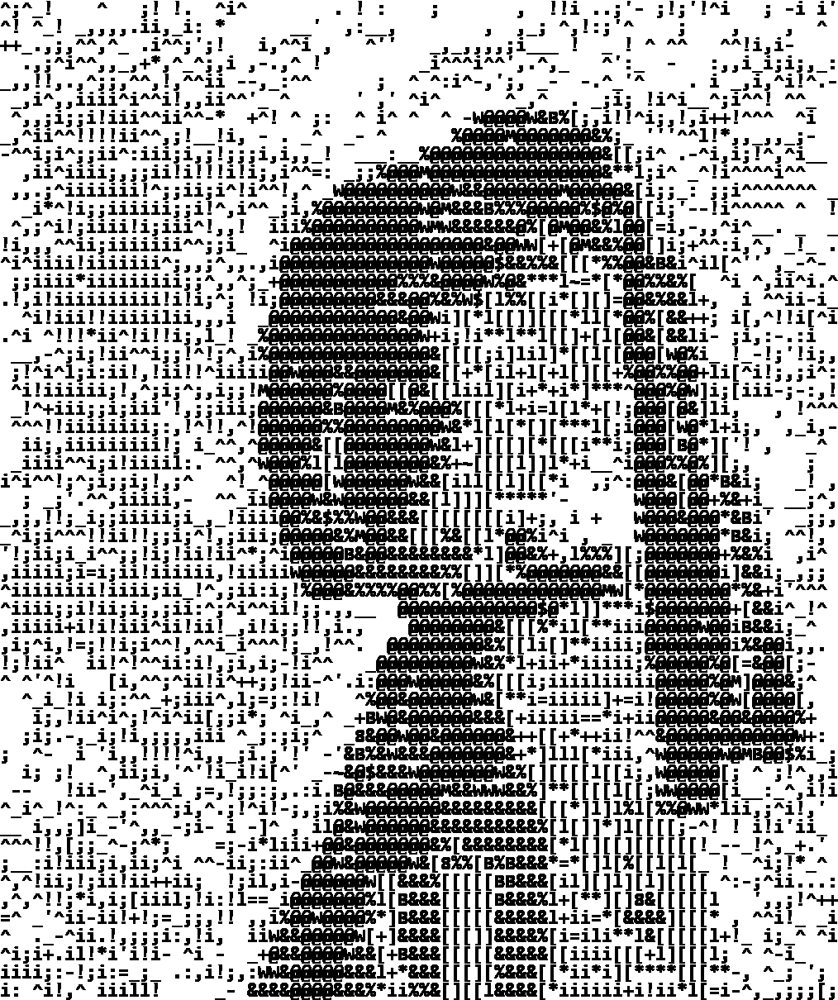
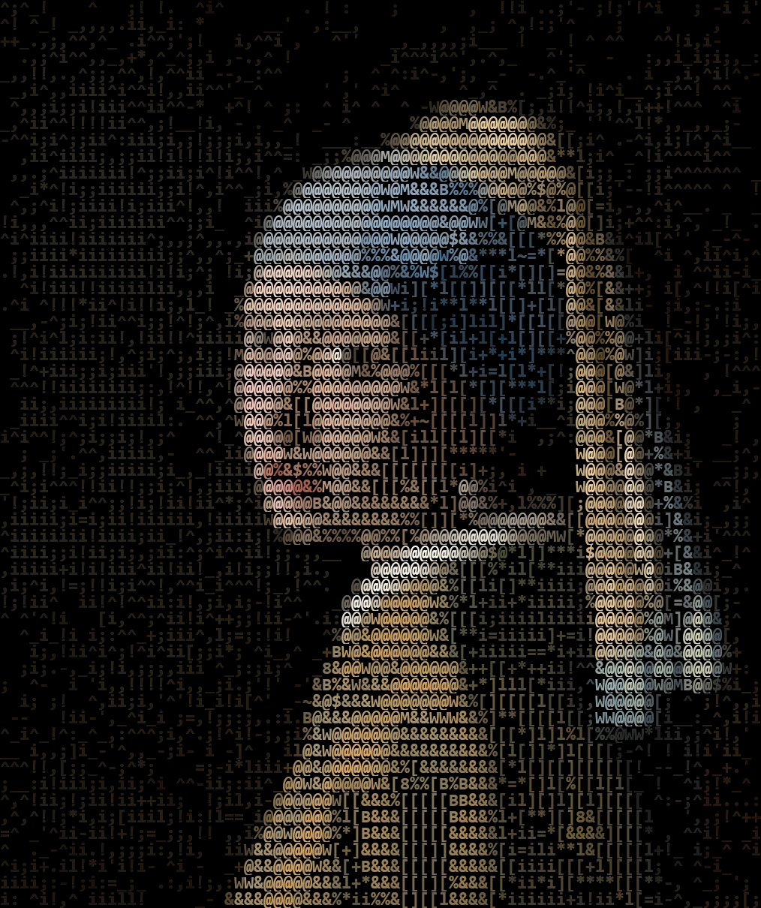
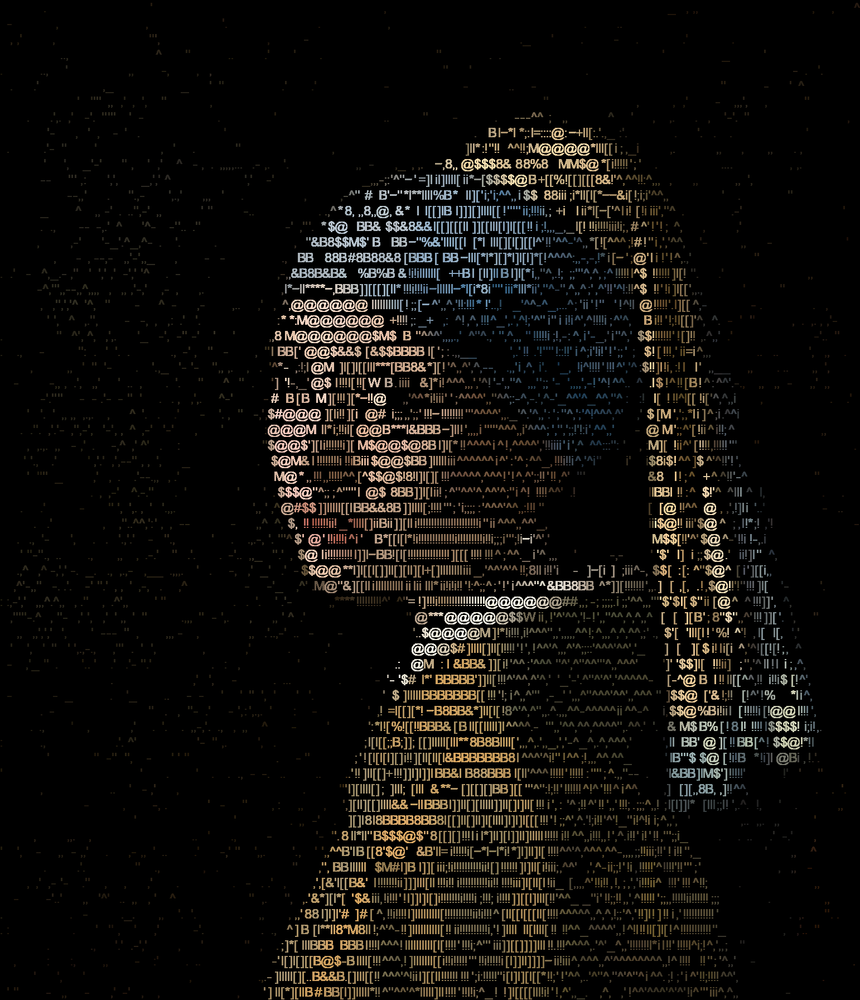

# Test 1

<p align="center">
    
</p>

| Test               | Property |
|--------------------|----------|
| Color Image        | ❌        |
| Invert Image Color | ❌        |
| ~~Save ASCII~~     | ❌        |

```commandline
python depth_shade.py ^
--image_path ../../resource/imgs/girl_with_pearl_earring.jpg ^
--resize_factor 2
```

---

# Test 2

<p align="center">
    
</p>

| Test               | Property |
|--------------------|----------|
| Color Image        | ✅        |
| Invert Image Color | ❌        |
| ~~Save ASCII~~     | ❌        |

```commandline
python depth_shade.py ^
--image_path ../../resource/imgs/girl_with_pearl_earring.jpg ^
--resize_factor 2 ^
--color_option original
```

---

# Test 5

```text
ii._,_i;_,=  __ _:, ,  ,,;';;^!; !,! :i
+_,^,_i;^;i_^^:  ' _:-,^^,^ .;'  ii!;,,
^i^i;i^i!!^!_^^ -_---:!:_'  ;;-;_i;,!^:
;,i:ii:,,^:+!^, ,^^' MM@@@@@%^:^]+^,_, 
!,i;i;ii:;ii,;+-_%@@@@@@@@@@W[;^-i:^;! 
 ^+i;!ii;i,;^^%@@@@@MWW@@@@@$@[;-i^^^^^
:,,iiiiii;,'_@@@@@@@@@&WMW@W%@[;l^;,_. 
^ii=iiiii;^_+@@@@@@$@@@@&%+l&@M&l=i ;,.
^^iii!i+;i; @@@@@@@@MW@%%[*+[@%&+.],![;
__!iii:!i=;i@@@@@@@@%i****+[[@$@%_:!;;;
-!;ii!i!;,i^@@@@@@@$%[l[+++l=@@@@++i^!,
^^iiiii;^^!^@@@&@@@@@&[[l[+ll@@M@[_,^i_
_ii:iii;i^^,@@W%@@@@W*[[=]*i*@@%@[;! ;^
 !'^iii;! ^:@@@W@@@W%][*l* ^:W@@@B&, :,
,;;,iiii;i;;;@@@W@W%%%[M@;:*,W@@@@&; ,i
ii;,;;;;;;!!i@@@@$&&B&[W@@@@&[@@@@B&_:^
iiiiiii!i;^;;i@@%%M@@@@@@@@@W[@@@@%&;;^
!!i+;i!:,!;!!i^^^ @@@@@%[%=*+i@@@@BW%_,
!!;_!+^^^;i+!!;-,@@@@@W%[i*iii@@@@@@@i 
 ;;ii;:!i];++!! +@@@@@W%+*il**@@@@@@@& 
_:^::!i,!;i;:i:,B@@M@@@@+][[iiW@@@@@@W_
 ^^;,:!;-ii,+_;%W@@@@W$W&l]]][B@@@ii,;;
,;-;--^_;^i_[^!@W@@@W&&&&%][*%%W$l-ii!_
;,;l,i;+  *;;!@@@@@@&%%%&%[[]]][[-!^i= 
_^!;i;!*;i;l+M@@@W%&&[[B&&]][%%[[+i:_i[
+ :i!;!*:;_iWW@@@%B&&[[&&&+]]%&[[[,^^!i
ii***];!.i,_@@@@W%%&&[l&&%*=]l*][+! ,i,
```

| Test                   | Property |
|------------------------|----------|
| ~~Color Image~~        | ❌        |
| ~~Invert Image Color~~ | ❌        |
| Save ASCII             | ✅        |

```commandline
python depth_shade.py ^
--image_path ../../resource/imgs/girl_with_pearl_earring.jpg ^
--resize_factor 1 ^
--save_ascii
```

---

# Test 6

<p align="center">
    
</p>

| Test               | Property |
|--------------------|----------|
| Color Image        | ✅        |
| Invert Image Color | ❌        |
| ~~Save ASCII~~     | ❌        |
| Anti-aliasing      | ✅        |

```commandline
python depth_shade.py ^
--image_path ../../resource/imgs/girl_with_pearl_earring.jpg ^
--resize_factor 2 ^
--color_option original ^
--antialiasing
```

---

# Test 7

<p align="center">
    
</p>

| Test               | Property |
|--------------------|----------|
| Color Image        | ✅        |
| Invert Image Color | ❌        |
| ~~Save ASCII~~     | ❌        |
| Fixed Width        | ❌        |

```commandline
python depth_shade.py ^
--image_path ../../resource/imgs/girl_with_pearl_earring.jpg ^
--resize_factor 3 ^
--thresholds_gamma 0.3 ^
--sigma_s 1 ^
--sigma_r 0.6 ^
--color_option original ^
--palette_path ../../resource/palette_files/palette_default_6_arial_fast.json ^
--char_weight_sum_factor 50 ^
--curr_layer_weight_factor 150 ^
--offset_mse_factor 10 ^
--coherence_score_factor 5
```
