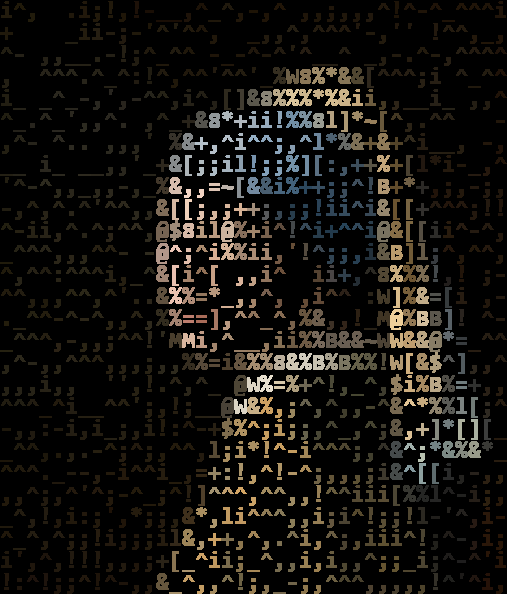
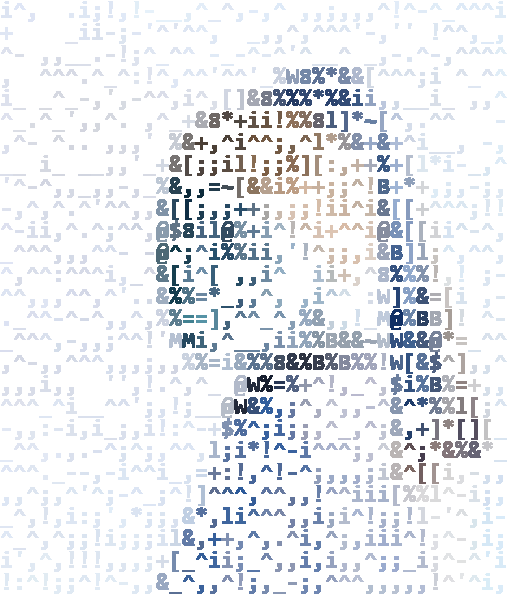
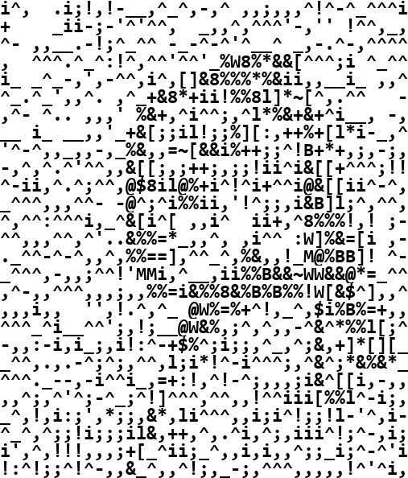

# Test 1

<p align="center">
    
</p>

| Test               | Property |
|--------------------|----------|
| Color Image        | ❌        |
| Invert Image Color | ❌        |

```commandline
python edge_gradient.py ^
--image_path ../../resource/imgs/girl_with_pearl_earring.jpg ^
--resize_factor 1 ^
--contrast_factor 1 ^
--thresholds_gamma 2
```

---

# Test 2

<p align="center">
    
</p>

| Test               | Property |
|--------------------|----------|
| Color Image        | ✅        |
| Invert Image Color | ❌        |

```commandline
python edge_gradient.py ^
--image_path ../../resource/imgs/girl_with_pearl_earring.jpg ^
--resize_factor 1 ^
--color_option original ^
--contrast_factor 1 ^
--thresholds_gamma 2
```

---

# Test 3

<p align="center">
    
</p>

| Test               | Property |
|--------------------|----------|
| Color Image        | ✅        |
| Invert Image Color | ✅        |

```commandline
python edge_gradient.py ^
--image_path ../../resource/imgs/girl_with_pearl_earring.jpg ^
--resize_factor 1 ^
--color_option original ^
--invert_color ^
--contrast_factor 1 ^
--thresholds_gamma 2
```

---

# Test 4

<p align="center">
    
</p>

| Test               | Property |
|--------------------|----------|
| Color Image        | ❌        |
| Invert Image Color | ✅        |

```commandline
python edge_gradient.py ^
--image_path ../../resource/imgs/girl_with_pearl_earring.jpg ^
--resize_factor 1 ^
--invert_color ^
--contrast_factor 1 ^
--thresholds_gamma 2
```

---

# Test 5

```text
i^,  .i;!,!-__,^_^,-,^ ,,;,,,^!^-^_^^^i
+    _ii-;-'^'^^,  _,,^,^^^'-,'' !^^,_,
^- ,,__.-!;^_^^ -_-^-^'^__^ _,-.^-,^^^^
,  ^^^.^_^:!^,^^'^^'_%W8%*&&[^^^;i ^_^^
i_ _^_-,',-^^,i^,[]&8%%%*%&ii,,__i_ ,,^
^_.^_',,^. ,^_+&8*+ii!%%8l]*~[^,.^^   -
,^- ^.. ,,,' %&+,^i^^;,^l*%&+&+^i__, -,
__ i_ __,,'_+&[;;il!;;%][:,++%+[l*i-_,^
'^-^,,_,,-,_%&,,=~[&&i%++;;^!B+*+,;,-;,
-,^,^.^'^^,,&[[;,;++;,;;!ii^i&[[+^^^;!!
^-ii,^.^;^^,@$8il@%+i^!^i+^^i@&[[ii^-^,
_^^^,,,^^- -@^;^i%%ii,'!^;;,i&B]l;^,^^,
^,^^:^^^i,_^&[i^[ ,,i^  ii+,^8%%%!,! ;-
^^,,,^^,^'..&%%=*_,,^, ,i^^ :W]%&=[i ,-
._^^-^-^,,^,%%==],^^_^,%&,,!_M@%BB]! ^-
_^^^,-,,;^^!'MMi,^__,ii%%B&&~WW&&@*=_^^
,^-,,^^^,,,;,,%%=i&%%8&%B%B%%!W[&$^],,^
,,,i,,  '',!.^,^_ @W%=%+^!,_^,$i%B%=+,,
^^^_^i__^^';,!;__@W&%,;^,^,,-^&^*%%l[;^
-,,:-i,i_;,i!:^-+$%^;i;;,^_,^;&,+]*[][_
_^^,.,.-^;^;,^^,l;i*!^-i^^^;,^&^;*&%&*_
^^^._--,-i^^i_,=+:!,^!-^;,,,;i&^[[i,-,,
,,^;,^'^;-^_;^!]^^^,^^,,!^^iii[%%l^-i;,
_^,!,i:;',*;;,&*,li^^^,,i;i^!;;!l-'^,i-
^_^,^;;!i;;;il&,++,^,.^i,^;,iii^!;^-,i;
i',^,!!!,,,;+[_^ii;_^,,i,i,,^;;_i;^-^'i
!:^!;;^!^-,,&_^,,^!;,_-;,^^^,,,,,!^'^i,
```

| Test                   | Property |
|------------------------|----------|
| ~~Color Image~~        | ❌        |
| ~~Invert Image Color~~ | ❌        |
| Save ASCII             | ✅        |

```commandline
python edge_gradient.py ^
--image_path ../../resource/imgs/girl_with_pearl_earring.jpg ^
--resize_factor 1 ^
--save_ascii ^
--contrast_factor 1 ^
--thresholds_gamma 2
```
