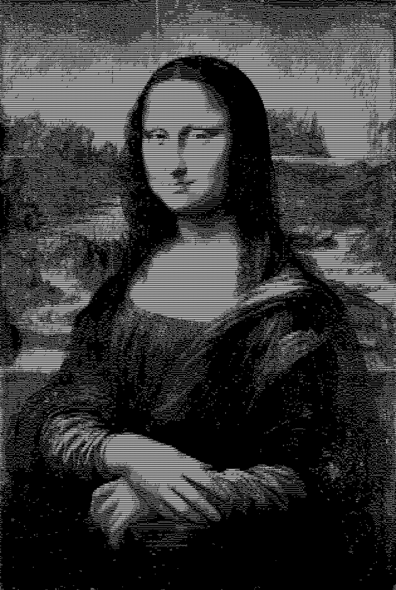

# Shade ASCII Filter

The shade filter renders the image with shading.
Unlike in the trace filter, where palette is optional,
shade filter requires you to set up a palette. 

## 📖 Guide: Shade ASCII Art
1️⃣ `cd` to `src/shade`.

2️⃣ Set up a palette. Recommended save directory is `resource/palette_files`.
Check out the [palette tutorial](../../palette_tut.md).

3️⃣ Execute `shade.py`.
**Example**:
```commandline
python shade.py --image_path ../../resource/imgs/monalisa.jpg --resize_factor 8
```

**Parameters**

| argument           | help                                                                                                                      |
|--------------------|---------------------------------------------------------------------------------------------------------------------------|
| --image_path       | The path of the image.                                                                                                    |
| --save_path        | The directory where the result image will be saved to.                                                                    |
| --resize_method    | The image resize method. Check below for available options.                                                               |
| --resize_factor    | The resize factor of the new image.                                                                                       |
| --contrast_factor  | The contrast factor based on the original image.                                                                          |
| --sigma_s          | The value of color smoothing in area.                                                                                     |
| --sigma_r          | The value of color smoothing in edges.                                                                                    |
| --thresholds_gamma | Controls the shading (gradient) levels. Higher value makes the algorithm emphasis the bright pixels. (Better granularity) |
| --palette_path     | Use a palette.                                                                                                            |
| --max_workers      | The maximum number of multithread workers.                                                                                |
| --invert_color     | If included, invert the color of the result image.                                                                        |
| --color_option     | The option to color the image. Check below for available options.                                                         |
| --save_ascii       | If included, the characters will be saved to a file.                                                                      |
| --save_ascii_path  | The path to save the characters. Check out the 'ascii_output' folder for the results.                                     |

**resize_method**

| code             | help                                          |
|------------------|-----------------------------------------------|
| nearest neighbor | Resize image with nearest neighbor algorithm. |
| bilinear         | Resize image with bilinear algorithm.         |

**color_option**

| code     | help                                                           |
|----------|----------------------------------------------------------------|
| original | Color the ASCII art with the (resized) original image's color. |

An example of ascii art image (compressed):

<p align="center">
    
</p>

---

🖼️ Also check out the [gallery](./gallery.md) for more examples!

---

⭐ Image Credit: monalisa (Wikipedia)

<p align="center">
    
</p>
