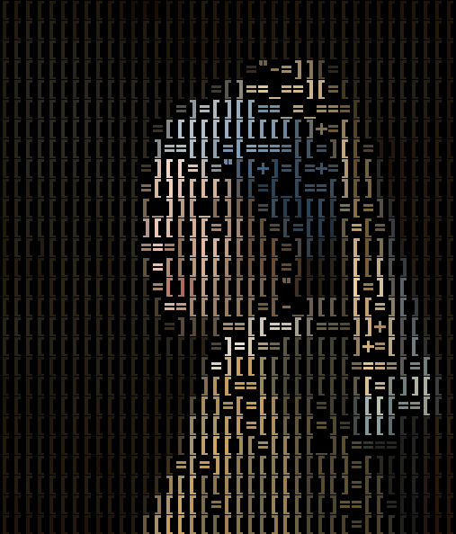
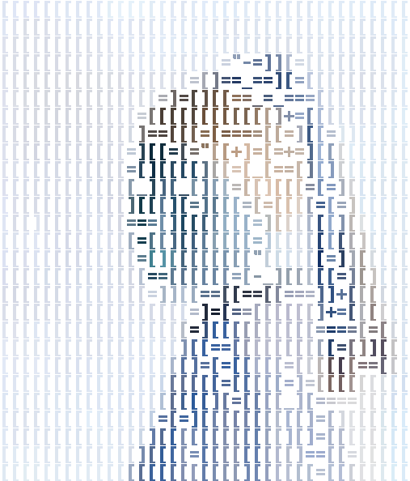
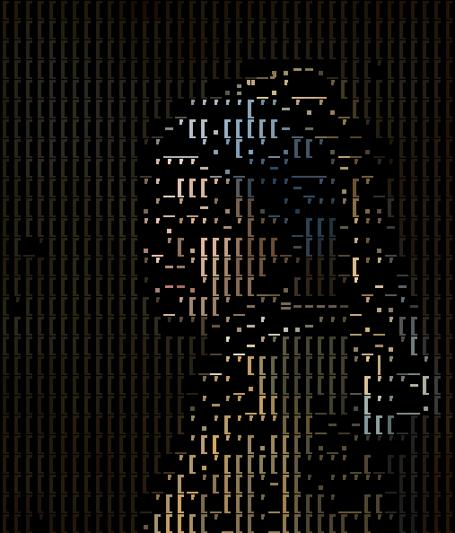
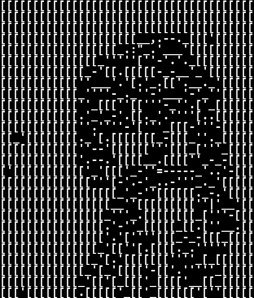
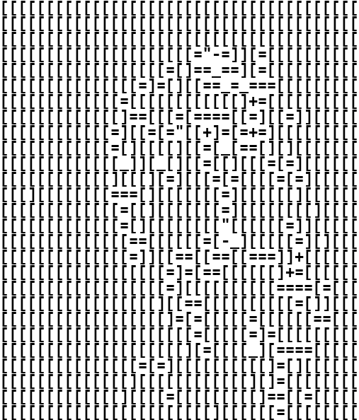
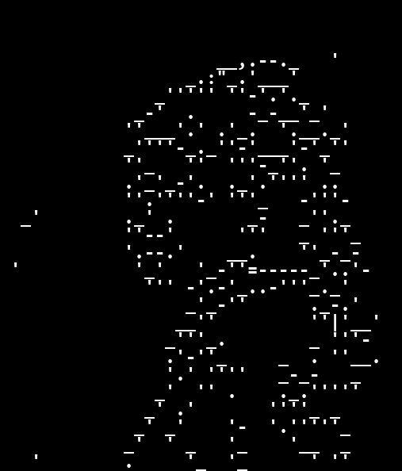

# Test 1

<p align="center">
    
</p>

| Test                 | Property |
|----------------------|----------|
| Algorithm            | Trace    |
| Color Image          | ✅        |
| Invert Contour Color | ✅        |
| Invert Image Color   | ❌        |
| ~~Save ASCII~~       | ❌        |

```commandline
python contour.py ^
--image_path ../../resource/imgs/girl_with_pearl_earring.jpg ^
--canny1_min 0 --canny1_max 270 --canny1_step 20 ^
--canny2_min 0 --canny2_max 270 --canny2_step 20 ^
--dilate_iter 1 --erode_iter 0 --gb_sigmaX 0 --gb_size 5 ^
--contrast_factor 4 --contrast_window_size 8 ^
--invert_color
```

```commandline
python trace.py ^
--image_path ./contour/contour_180_260.png ^
--resize_factor 1 ^
--palette_path ../../resource/palette_files/palette_chars.json ^
--match_method slow ^
--color_option original ^
--original_image_path ../../resource/imgs/girl_with_pearl_earring.jpg
```

---

# Test 2

<p align="center">
    
</p>

| Test                 | Property |
|----------------------|----------|
| Algorithm            | Trace    |
| Color Image          | ✅        |
| Invert Contour Color | ✅        |
| Invert Image Color   | ✅        |
| ~~Save ASCII~~       | ❌        |

```commandline
python contour.py ^
--image_path ../../resource/imgs/girl_with_pearl_earring.jpg ^
--canny1_min 0 --canny1_max 270 --canny1_step 20 ^
--canny2_min 0 --canny2_max 270 --canny2_step 20 ^
--dilate_iter 1 --erode_iter 0 --gb_sigmaX 0 --gb_size 5 ^
--contrast_factor 4 --contrast_window_size 8 ^
--invert_color
```

```commandline
python trace.py ^
--image_path ./contour/contour_180_260.png ^
--resize_factor 1 ^
--palette_path ../../resource/palette_files/palette_chars.json ^
--match_method slow ^
--color_option original ^
--original_image_path ../../resource/imgs/girl_with_pearl_earring.jpg ^
--invert_color
```

---

# Test 5

```text
[[[[[[[[[[[[[[[[[[[[[[[[[[[[[[[[[[[[[[[
[[[[[[[[[[[[[[[[[[[[[[[[[[[[[[[[[[[[[[[
[[[[[[[[[[[[[[[[[[[[[[[[[[[[[[[[[[[[[[[
[[[[[[[[[[[[[[[[[[[[[="-=]][=[[[[[[[[[[
[[[[[[[[[[[[[[[[[[=[]==_==][=[[[[[[[[[[
[[[[[[[[[[[[[[[=]=[][[==_=_===[[[[[[[[[
[[[[[[[[[[[[[=[[[[[[[[[[[[]+=[[[[[[[[[[
[[[[[[[[[[[[[]==[[[=[====[[=][[=]][[[[[
[[[[[[[[[[[[=][[=[="[[+]=[=+=][[[[[[[[[
[[[[[[[[[[[[=[][[[[][[=[_[==[][][[[[[[[
[[[[[[[[[[[[[_]][_[][[=[[][[[=[=][[[[[[
[[[[[[[[[[[[][[[][=][[[=[=[[[[=[=][[[[[
[[[][[[[[[[[===[][[[[[[[=][[[[[[][[[[[[
[[[[[[[[[[[[[=[[][[[[[[[=][[[[[[[[][[[[
[[[[[[[[[[[[[=[][[[[[[[["[[[[[[=]][[[[[
[[[[[[[[[[[[[[==[[[[[[=[-_][[[[[=][][[[
[[[[[[[[[[[[[[=]][[==[[==[[===]]+[[[[[[
[[[[[[[[[[[[[[[[[[=]=[==[[[[[[]+=[[[[[[
[[[[[[[[[[[[[[[[[[=][[[[[[[[[[====[=[[[
[[[[[[[[[[[[[[[[[][[==[[[[[[[[[[=[]][[[
[[[[[[[[[[[[[[[[[[]=[=[[[[[=[[[[[[==[[[
[[[[[[[[[[[[[[[[[[[[[=[[[[[=]=[[[[[[[[[
[[[[[[[[[[[[[[[[[[[[][=[[[[_][====[[[[[
[[[[[[[[[[[[[[[=[=][[[[[[[[[[]=[][[[[[[
[[[[[[[[[[[[[[][[[[[[[[[[[[][]=[[[[[[[[
[[[[[[[[[[[[[][[[[=[[[[[[[[[]==[[=[[[[[
[[[[[[[[[[[[[[[[[[[[[[[][[[[[[=[[[[[[[[
```

| Test                   | Property |
|------------------------|----------|
| Algorithm              | Trace    |
| ~~Color Image~~        | ✅        |
| Invert Contour Color   | ✅        |
| ~~Invert Image Color~~ | ❌        |
| Save ASCII             | ✅        |

```commandline
python contour.py ^
--image_path ../../resource/imgs/girl_with_pearl_earring.jpg ^
--canny1_min 0 --canny1_max 270 --canny1_step 20 ^
--canny2_min 0 --canny2_max 270 --canny2_step 20 ^
--dilate_iter 1 --erode_iter 0 --gb_sigmaX 0 --gb_size 5 ^
--contrast_factor 4 --contrast_window_size 8 ^
--invert_color
```

```commandline
python trace.py ^
--image_path ./contour/contour_180_260.png ^
--resize_factor 1 ^
--palette_path ../../resource/palette_files/palette_chars.json ^
--match_method slow ^
--color_option original ^
--original_image_path ../../resource/imgs/girl_with_pearl_earring.jpg ^
--save_ascii
```

---

# Test 3

<p align="center">
    
</p>

| Test               | Property   |
|--------------------|------------|
| Algorithm          | Trace-Join |
| Color Image        | ✅          |
| Invert Image Color | ❌          |
| ~~Save ASCII~~     | ❌          |

```commandline
python trace_join.py ^
--image_path ../../resource/imgs/girl_with_pearl_earring.jpg ^
--canny1 180 ^
--canny2 260 ^
--gb_size 5 ^
--gb_sigmaX 0 ^
--kernel_size 2 ^
--dilate_iter 1 ^
--erode_iter 0 ^
--contrast_factor 4 ^
--contrast_window_size 8 ^
--resize_factor 1 ^
--resize_method nearest_neighbor ^
--match_method slow ^
--palette_path ../../resource/palette_files/palette_chars.json ^
--color_option original
```

---

# Test 6

<p align="center">
    
</p>

| Test               | Property   |
|--------------------|------------|
| Algorithm          | Trace-Join |
| Color Image        | ❌          |
| Invert Image Color | ❌          |
| ~~Save ASCII~~     | ❌          |

```commandline
python trace_join.py ^
--image_path ../../resource/imgs/girl_with_pearl_earring.jpg ^
--canny1 180 ^
--canny2 260 ^
--gb_size 5 ^
--gb_sigmaX 0 ^
--kernel_size 2 ^
--dilate_iter 1 ^
--erode_iter 0 ^
--contrast_factor 4 ^
--contrast_window_size 8 ^
--resize_factor 1 ^
--resize_method nearest_neighbor ^
--match_method slow ^
--palette_path ../../resource/palette_files/palette_chars.json
```

---

# Test 7

<p align="center">
    
</p>

| Test                 | Property |
|----------------------|----------|
| Algorithm            | Trace    |
| Color Image          | ❌        |
| Invert Contour Color | ✅        |
| Invert Image Color   | ❌        |
| ~~Save ASCII~~       | ❌        |

```commandline
python contour.py ^
--image_path ../../resource/imgs/girl_with_pearl_earring.jpg ^
--canny1_min 0 --canny1_max 270 --canny1_step 20 ^
--canny2_min 0 --canny2_max 270 --canny2_step 20 ^
--dilate_iter 1 --erode_iter 0 --gb_sigmaX 0 --gb_size 5 ^
--contrast_factor 4 --contrast_window_size 8 ^
--invert_color
```

```commandline
python trace.py ^
--image_path ./contour/contour_180_260.png ^
--resize_factor 1 ^
--palette_path ../../resource/palette_files/palette_chars.json ^
--match_method slow ^
--original_image_path ../../resource/imgs/girl_with_pearl_earring.jpg
```

---

# Test 8

<p align="center">
    
</p>

| Test                 | Property |
|----------------------|----------|
| Algorithm            | Trace    |
| Color Image          | ❌        |
| Invert Contour Color | ❌        |
| Invert Image Color   | ❌        |
| ~~Save ASCII~~       | ❌        |

```commandline
python contour.py ^
--image_path ../../resource/imgs/girl_with_pearl_earring.jpg ^
--canny1_min 0 --canny1_max 270 --canny1_step 20 ^
--canny2_min 0 --canny2_max 270 --canny2_step 20 ^
--dilate_iter 1 --erode_iter 0 --gb_sigmaX 0 --gb_size 5 ^
--contrast_factor 4 --contrast_window_size 8
```

```commandline
python trace.py ^
--image_path ./contour/contour_180_260.png ^
--resize_factor 1 ^
--palette_path ../../resource/palette_files/palette_chars.json ^
--match_method slow ^
--original_image_path ../../resource/imgs/girl_with_pearl_earring.jpg
```
